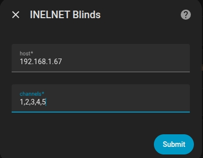
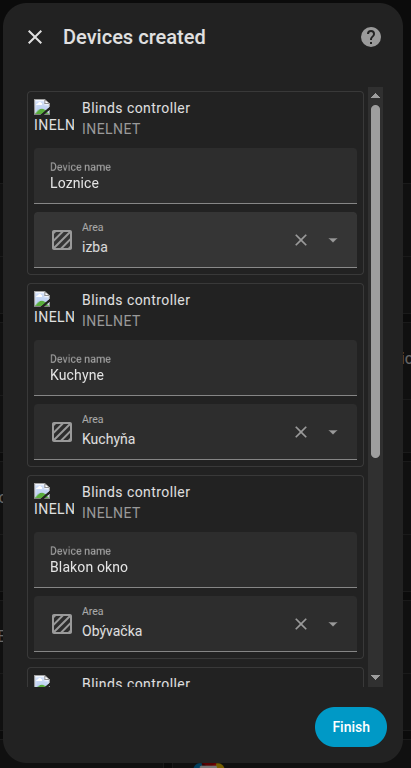

# inelnet_ha

Home Assistant integration for controlling INELNET blinds via REST API. You define all channels in one setup step (IP + comma-separated channel list). Each channel becomes one device with four entities: one cover (open/close/stop) and three buttons (Short move up, Short move down, Programming mode).

## Installation

For full setup steps see **[Setup guide →](https://github.com/Hadatko/inelnet_ha#)**.

1. Copy the `custom_components/inelnet` folder into your Home Assistant `<config>/custom_components/inelnet` (or clone the repo and symlink).
2. Restart Home Assistant.
3. **Settings → Devices & services → Add integration** → search for "INELNET Blinds".
4. Enter the controller **IP address** (e.g. `192.168.1.67`) and **all channel numbers** comma-separated (e.g. `1` or `1,2,3`). Channels are 1–16. One device per channel is created.  
   **Channel definition** (entered when adding the integration):

   

5. Optionally assign each channel to a room in Home Assistant (**Channel → Room**):

   

6. Each device has **4 entities**: the cover (open/close/stop) plus three buttons (Short move up, Short move down, Programming mode).

## Usage

- **Cover** – open/close/stop via UI or `cover.open_cover`, `cover.close_cover`, `cover.stop_cover`.
- **Buttons** – one entity per action: Short move up, Short move down, Programming mode (for pairing a remote). Use in dashboards or automations.
- **Device Actions** – the same actions are also available when building automations/scenes as device actions.

## Technical details

The integration sends POST requests to `http://<host>/msg.htm` with body `send_ch=<channel>&send_act=<code>`. Codes: 144 stop, 160 up, 176 up_short, 192 down, 208 down_short, 224 program.

---

If anybody is interested in supporting my "sleepless" nights (working mostly between 23:00-3:00) on different projects press:

Thank you ;)

Ideas are welcome. But PRs are welcome more ;)
